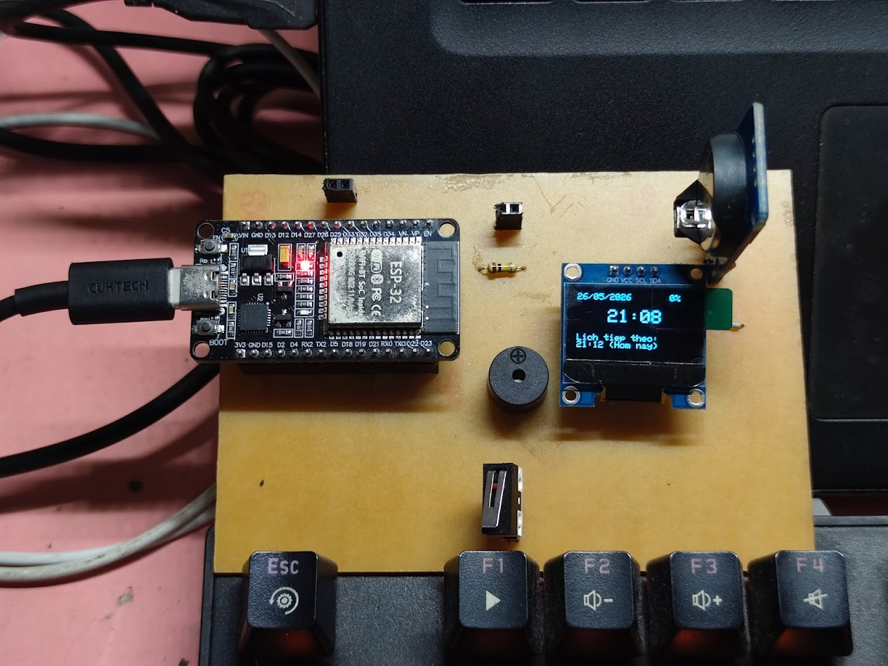
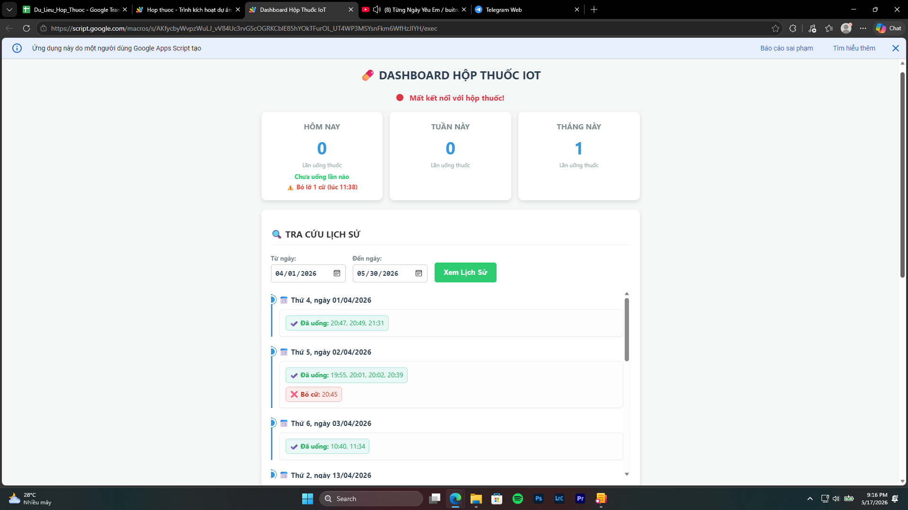
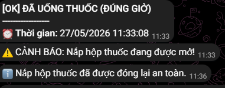

# 💊 IoT Smart Pillbox - Hộp Thuốc Thông Minh


**IoT Smart Pillbox** là hệ thống hộp thuốc điện tử thông minh được thiết kế nhằm hỗ trợ người cao tuổi và bệnh nhân trong việc tuân thủ phác đồ điều trị. Dự án ứng dụng vi điều khiển ESP32, kết hợp đồng bộ hóa đám mây qua Google Apps Script và hệ thống cảnh báo tức thời qua Telegram.

> **Đồ án môn học 1 (EE3183)** > Khoa Điện - Điện tử, Trường Đại học Bách Khoa - ĐHQG TP.HCM.

---

## ✨ Tính năng nổi bật
* **Định thời gian thực chuẩn xác:** Sử dụng module RTC DS3231 đảm bảo báo thức hoạt động chính xác ngay cả khi mất kết nối Internet.
* **Cấu hình Wi-Fi động (Captive Portal):** Cho phép người dùng kết nối mạng mới thông qua điện thoại thông minh (WiFiManager) mà không cần nạp lại mã nguồn.
* **Theo dõi & Báo cáo đám mây:** Tự động đẩy lịch sử đóng/mở nắp hộp (thông qua công tắc hành trình) lên Google Sheets.
* **Cảnh báo Telegram tức thời:** Gửi tin nhắn thông báo cho người nhà khi đến giờ uống thuốc, uống thuốc trễ hoặc mở hộp sai giờ.
* **Tối ưu năng lượng:** Tích hợp tính năng Deep Dimming (giảm sáng màn hình OLED) để tiết kiệm pin tối đa.
* **Lưu trữ ngoại tuyến (Offline Mode):** Lưu trữ tạm thời dữ liệu vào bộ nhớ Flash (NVS) khi rớt mạng và tự động đồng bộ lại khi có kết nối.

---

## 📂 Cấu trúc thư mục (Directory Tree)

```text
IoT-Smart-Pillbox/
├── 📁 Firmware/
│   └── 📄 ESP32_Pillbox.ino          # Mã nguồn C++ nạp cho vi điều khiển ESP32 (File đọc Arduino IDE)
│   └── 📄 ESP32_Pillbox.cpp          # Mã nguồn C++ nạp cho vi điều khiển ESP32 (File chuẩn hoá định dạng code C++)
├── 📁 Web_App_Script/
│   ├── 📄 Code.gs                    # Mã nguồn Backend (Google Apps Script)
│   └── 📄 Index.html                 # Giao diện Web quản lý (Frontend)
├── 📁 Hardware/
│   ├── 📄 Schematic_Altium.pdf       # File PDF bản vẽ sơ đồ nguyên lý
│   └── 📄 BOM.csv                    # Bảng danh mục vật tư (Bill of Materials)
│   └── 📁 Altium PCB Project         # Thư mục chứa toàn bộ dự án thiết kế PCB bằng Altium
├── 📁 Docs/
│   ├── 📄 BAO_CAO_DO_AN_1.pdf        # File báo cáo chi tiết của đề tài
│   └── 📁 Source_Code_LaTeX          # Source Code LaTeX của bài báo cáo 
└── 📄 README.md                      # Tài liệu hướng dẫn của đề tài

```
## 🛠️ Cài đặt & Triển khai hệ thống

### 1. Thi công phần cứng
* Lắp ráp các linh kiện điện tử theo đúng sơ đồ nguyên lý (`Schematic_Altium.pdf`) được cung cấp trong thư mục `Hardware`.
* Dưới đây là hình ảnh nguyên mẫu phần cứng sau khi thi công và tích hợp vào vỏ hộp:

> **📸 Hình ảnh mạch thực tế:**
> 
> 

---

### 2. Triển khai Cơ sở dữ liệu (Google Sheets & Apps Script)
Hệ thống sử dụng Google Sheets làm cơ sở dữ liệu miễn phí và Google Apps Script làm Backend API.

1. **Tạo Google Sheet:** Tạo một bảng tính mới để lưu trữ nhật ký.
   * 👉 [🔗 Cơ sở dữ liệu Google Sheet của dự án](https://docs.google.com/spreadsheets/d/1F7vB3ncXRynr4YONkt-7NzRndev7CFtMYesXiH4w0Is/edit?usp=sharingx)
2. **Triển khai Script:** * Mở `Tiện ích mở rộng` -> `Apps Script`.
   * Copy nội dung file `Web_App_Script/Code.gs` và `Index.html` dán vào.
   * Chọn `Phát triển` -> `Triển khai mới` -> Chọn loại `Ứng dụng Web` (Quyền truy cập: Bất kỳ ai).
   * **Lưu lại đường dẫn Web App URL** để nạp vào ESP32.
   * 👉 [🔗 Đường link Web Dashboard của dự án](https://docs.google.com/spreadsheets/d/1F7vB3ncXRynr4YONkt-7NzRndev7CFtMYesXiH4w0Is/edit?usp=sharingx](https://script.google.com/macros/s/AKfycbyWvpzWuLJ_vV84Uc3rvG5cOGRKCblE85hYOkTFurOL_UT4WP3MSYsnFkm6WfHzJIYH/exec)

---

### 3. Nạp mã nguồn ESP32 (Firmware)
1. Cài đặt [Arduino IDE](https://www.arduino.cc/en/software) và thêm board ESP32 vào Board Manager.
2. Cài đặt các thư viện bắt buộc thông qua Library Manager:
   * `WiFiManager` (bởi tzapu)
   * `RTClib` (bởi Adafruit)
   * `Adafruit SSD1306` & `Adafruit GFX Library`
   * `NTPClient` (bởi Fabrice Weinberg)
3. Mở file `Firmware/ESP32_Pillbox.ino`.
4. Tìm đến vùng cấu hình và thay thế các thông số sau bằng thông tin của bạn:
   ```cpp
   String googleScriptUrl = "Dán_Web_App_URL_của_bạn_vào_đây";
   String botToken = "Dán_Token_Telegram_Bot_của_bạn_vào_đây";
   String chatId = "Dán_Chat_ID_của_bạn_vào_đây";
   ```
5. Kết nối ESP32 với máy tính qua cáp Type-C và bấm Upload.

## 🚀 Hướng dẫn Sử dụng Hệ thống

Bước 1: Cấu hình mạng Wi-Fi (Captive Portal)
   * Cấp nguồn cho thiết bị. Nếu mạch chưa có thông tin Wi-Fi, nó sẽ tự động phát ra một mạng Wi-Fi có tên là `Hop_thuoc_IoT`.
   * Dùng điện thoại kết nối vào mạng Wi-Fi này. Một trang đăng nhập sẽ tự động hiện ra (Captive Portal). Bạn chỉ cần chọn mạng Wi-Fi nhà mình, nhập mật khẩu và bấm Save. Thiết bị sẽ tự khởi động lại và online.

Bước 2: Cài đặt lịch trình qua Web Dashboard
  * Truy cập vào đường dẫn Web App (từ bước triển khai Apps Script) bằng điện thoại hoặc máy tính.
  * Tại đây, người quản lý có thể cập nhật các cữ thuốc, xem lịch sử đóng/mở nắp và kiểm tra thống kê tuân thủ.

> **📸 Giao diện Trang quản trị Web:**
> 
> 

Bước 3: Nhận thông báo qua Telegram
  * Khi đến giờ, hộp thuốc sẽ phát tiếng bíp và sáng màn hình.
  * Khi người bệnh mở nắp đúng giờ hoặc sai giờ, tin nhắn cảnh báo sẽ ngay lập tức được đẩy về ứng dụng Telegram của người nhà.

> **📸 Thông báo Telegram Bot:**
> 
> 

---

## 📄 Bản quyền và Cấp phép (Credits & License)

Dự án này là sản phẩm thuộc **Đồ án môn học 1 (EE3183)**. 
Bản quyền mã nguồn, tài liệu và thiết kế cơ khí thuộc về chủ sở hữu (**Nguyễn Minh Thuận**) và **Khoa Điện - Điện tử, Trường Đại học Bách Khoa - ĐHQG TP.HCM**. 

*Vui lòng trích dẫn nguồn đầy đủ và tôn trọng quyền tác giả nếu bạn tham khảo hoặc sử dụng lại các tài liệu từ kho lưu trữ này cho mục đích học tập.*
